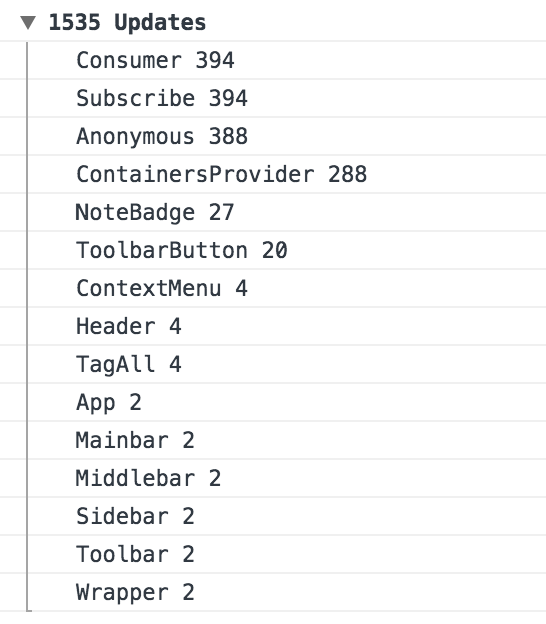

# React Log Names

Log the number of updates occurring, broken down by components.

## Install

```sh
npm install --save react-log-updates
```

## Usage

```ts
import logUpdates from 'react-log-updates;

logUpdates ({
  enabled: IS_DEVELOPMENT
  // collapsed: false // Don't collapse the console group
  // include: /Foo|Bar/i // Filter out if the name of the component doesn't match this regex
  // exclude: /Baz/i // Filter out if the name of the component matches this regex
});
```

## Demo



## License

MIT © Fabio Spampinato
